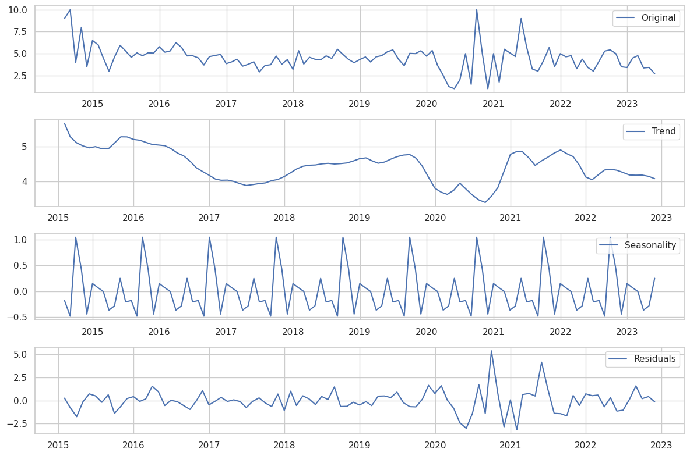
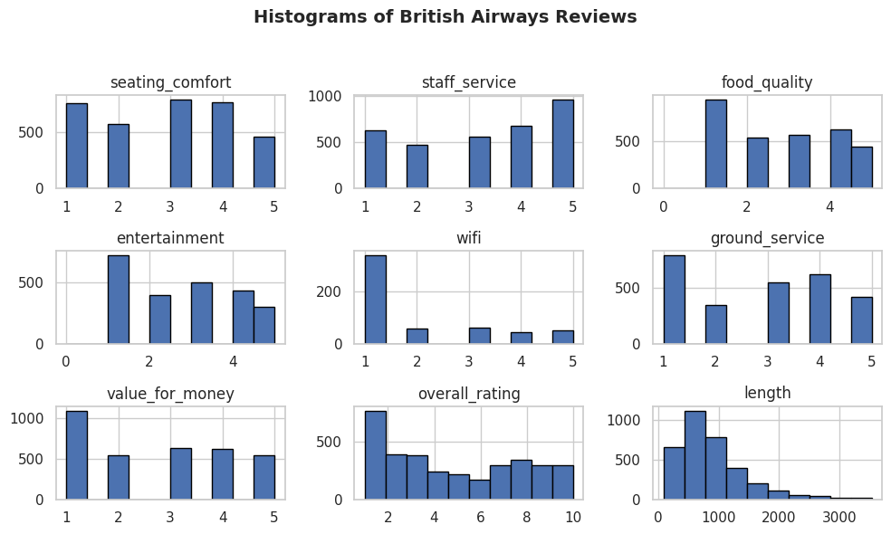
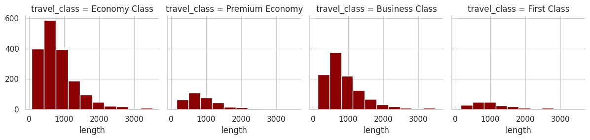
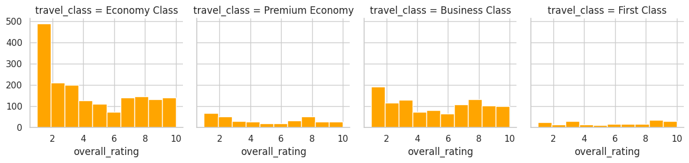
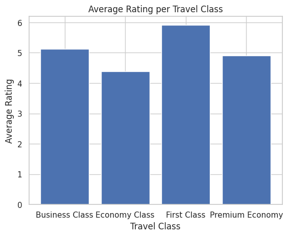
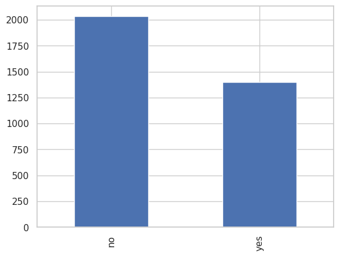
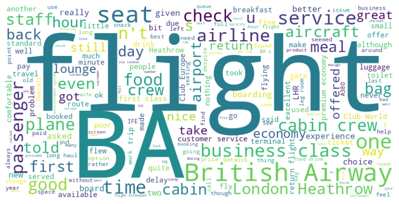

# British Airways Project

In progress...

This project was part of a virtual experience program at [British Airways](https://www.theforage.com/virtual-internships/prototype/NjynCWzGSaWXQCxSX/Data-Science?ref=Zca4MBFp2EyABm3Co).

**Task 1:**

Scrape and analyse customer review data to uncover findings for British Airways.

**Task 2:**

Build a predictive model to understand factors that influence buying behavior.

--- 

# Task 1

First data was scrapped from [Skytrax](https://www.airlinequality.com/airline-reviews/british-airways) website. This was my first attempt at scrapping data and I was sucessful in scraping most of the data. However I was struggling with scraping the star ratings that users gave. To help, I used this [notebook](https://www.kaggle.com/code/minnikeswarrao/web-scraping-on-skytrax-com/notebook). 

The next stages inovled cleaning the data and checking for missing values. Futher details on ths can be seen in the notebook.

## Exploratory Data Analysis

**How has overall customer ratings for British Airways evolved over time?**

**Observation**

- After decomposing the time series additively, we see a clear and consistent decreasing trend in the overall rating from customers over the period of 2015 to 2023. 
- The residuals are centered around 0, which supports the use of an additive model.
- The noise observed from mid-2020 to mid-2021 in the residuals may be attributed to the linear interpolation used to fill in the missing values during that period.

**Distribution of review ratings for British Airways**

**Length of reviews per travel class**

**Overall rating given per travel class**

**Average overall rating per travel class**

**How many customers would recommend British Airways?**

**Word Cloud. What are the most frequent words?**

