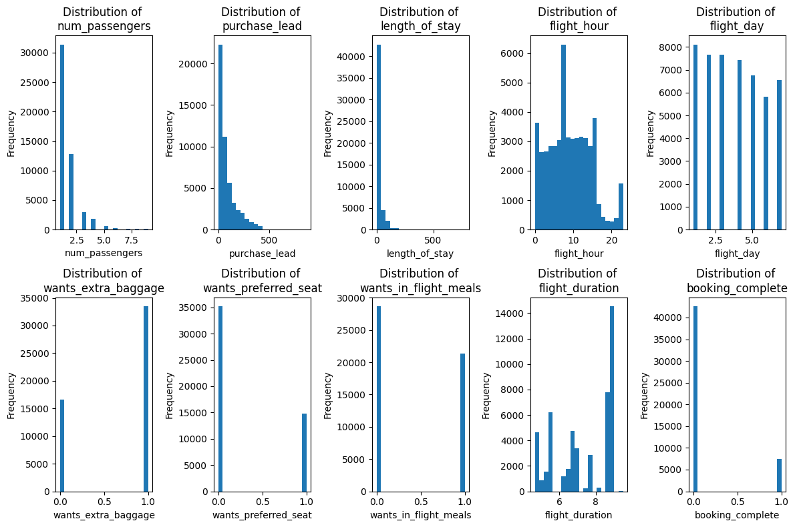
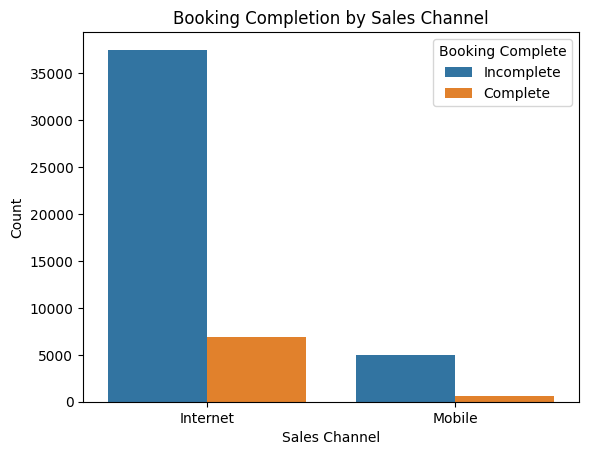
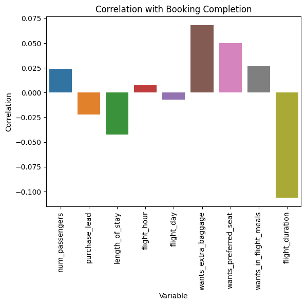
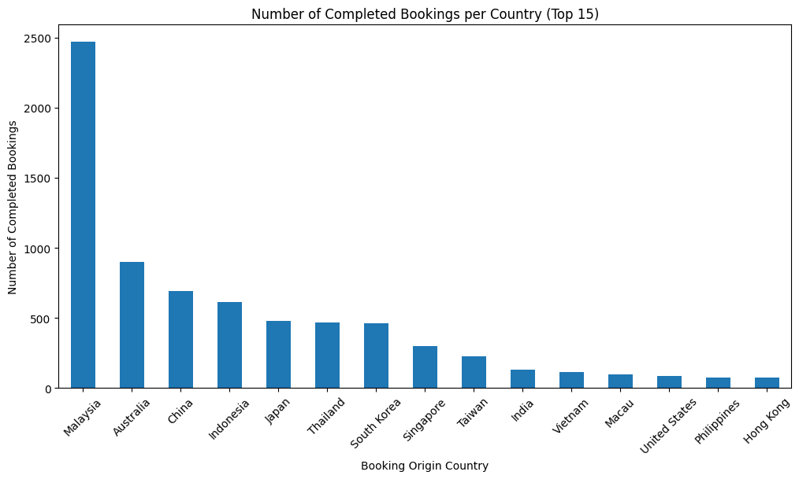
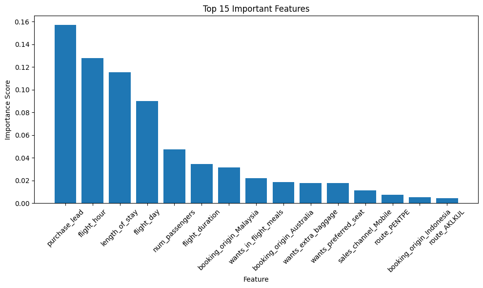

# British Airways Project

**Task 1:**

Scrape and analyse customer review data to uncover findings for British Airways.

**Task 2:**

Build a predictive model to understand factors that influence buying behaviour.

--- 

# Task 1

First data was scrapped from [Skytrax](https://www.airlinequality.com/airline-reviews/british-airways) website. 

The next stages involved cleaning the data and checking for missing values. Further details on this can be seen in the notebook.

## Exploratory Data Analysis

**How have overall customer ratings for British Airways evolved over time?**

**Observation**

- After decomposing the time series additively, we see a clear and consistent decreasing trend in the overall rating from customers over the period of 2015 to 2023. 
- The residuals are centred around 0, which supports the use of an additive model.
- The noise observed from mid-2020 to mid-2021 in the residuals may be attributed to the linear interpolation used to fill in the missing values during that period.

**Distribution of review ratings for British Airways**

**Observation**
- Looking at the distribution for overall rating, we see that most people give a rating of 1. Other than that, there does not seem to be any difference between the other ratings.
- We see that most guests are not satisfied with the WiFi service.
- The staff service receives high ratings, with most people giving 4 and 5 stars.
- There seems to be a uniform distribution of seating comfort.
- Most people write between 500 and 1000 words per review.

**Length of reviews per travel class**

**Observation**
- We see, there does seem to be an unbalanced dataset. A lot more people have travelled to the economy and business section of this dataset. The distributions follow the same shape between different travel classes.

**Overall rating is given per travel class**

**Average overall rating per travel class**

**How many customers would recommend British Airways?**

**Word Cloud. What are the most frequent words?**

# Task 2

## Exploratory Data Analysis

## Model Results

**Performance Metrics**

| Metric    | Value   |
|-----------|---------|
| Accuracy  | 0.846   |
| Precision | 0.483   |
| Recall    | 0.123   |
| F1-score  | 0.197   |

The model has a high accuracy but a low precision and recall. So more work can be done to improve it.

